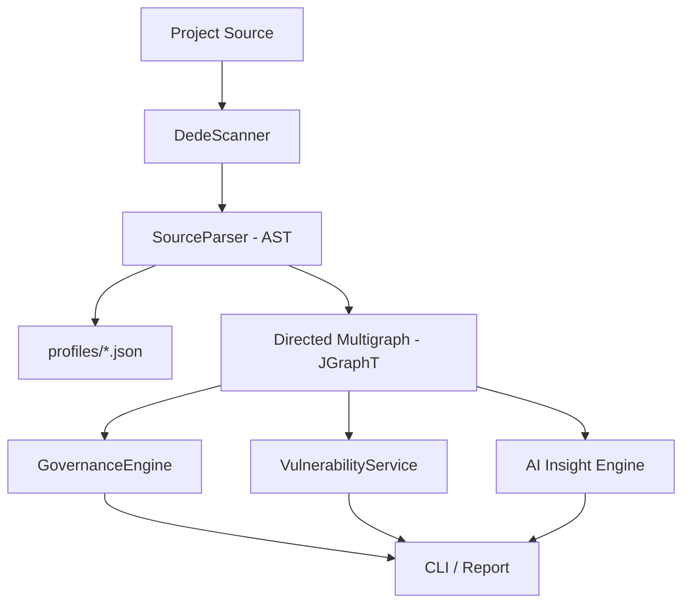

# 🏗️ dede-java: Architectural Specification (v0.3.0)

## 🌟 Vision
`dede-java` is a high-performance **Architectural Intelligence Engine** designed specifically for the AEM/OSGi ecosystem. Unlike standard static analysis tools (SonarQube) or binary validators (AEM Analyser), `dede-java` builds a **Topological Map** of the entire system to detect architectural debt, security reachability, and governance violations.

---

## 🧩 System Architecture

The system follows a **Modular Pipeline Architecture**, centered around a **Directed Multigraph**.

### 1. The Core: The Directed Multigraph
The "Brain" of the system is a JGraphT-powered multigraph. Every architectural element is a **Node**, and every dependency is an **Edge**.
- **Nodes (`NodeType`)**: `OSGI_COMPONENT`, `SLING_MODEL`, `WORKFLOW_PROCESS`, `SLING_JOB`, `HTL_FILE`, `PACKAGE`, `CLASS`, `INTERFACE`.
- **Edges (`RelationshipType`)**: `WIRES_TO` (Bundle), `ADAPTS_TO` (Model), `REFERENCES` (Servlet), `CONSUMES` (Service), `CONFIG_BY` (Config), `DECLARES` (Method).

### 2. The Eye: SourceParser (AST-based)
We use **JavaParser** for pure AST analysis.
- **Why?**: To avoid "Classloading Hell" and classpath pollution. We can analyze AEM code without needing the AEM SDK on the classpath.
- **Traceability**: It maps annotations to graph nodes. It doesn't just see a `@Reference`; it understands that this creates a `CONSUMES` relationship between two specific OSGi services.

### 3. The Compositional Profile Engine
The "Configurability Layer" that prevents the tool from being "Too Generic."
- **Profiles**: JSON files that define mapping rules.
- **Composition**: Multiple profiles (e.g., `aem`, `osgi`, `custom`) are merged at runtime to create a specialized "Expert Persona" for the scan.

### 4. The Analysts
- **GovernanceEngine**: Executes graph queries to find "Forbidden Paths" (e.g., a UI component directly calling a DB-level service).
- **VulnerabilityService**: Performs **Reachability Analysis**. It doesn't just find a CVE in a JAR; it checks if there is a directed path from a Public Endpoint (Servlet) to the vulnerable code.
- **AI Insight Engine**: Analyzes graph topology (Centrality, Coupling, Cycles) to suggest refactors like "God Bundle" splitting.

---

## 🛡️ High-Confidence Intelligence (v0.7.0)

To minimize false positives in large-scale repositories (like AEM Core Components), `dede-java` implements a precision scoring system.

### 1. Confidence Scoring
Every relationship in the graph has a `confidence` score (0-100%):
- **100% (Verified)**: Relationships found via OSGi/Sling Annotations or Manifest headers.
- **70% (Heuristic)**: Relationships found via dynamic code analysis (e.g., manual `adaptTo` or `getService` calls).
- **50% (Pattern-match)**: Relationships found via Dispatcher glob patterns or JCR path heuristics.

### 2. Export Awareness (Library Mode)
`dede-java` is "Library Aware." If a Java package is listed in the `Export-Package` manifest header, all classes within that package are marked as **`isExported`**.
- **Impact**: Exported classes are **excluded** from "Dead Code" or "Zombie Code" refactoring suggestions by default, as their consumers likely live in external repositories.

---

## 🌊 The "Sling Waterfall" Traceability
One of the most advanced features is the ability to trace dependencies across disparate technologies:
1. **HTL File** ➡️ `data-sly-use.com.example.Model`
2. **Sling Model** ➡️ `@Model(adaptables=Resource.class, resourceType="my/comp")`
3. **OSGi Service** ➡️ `@Reference private MyService svc;`
4. **Implementation** ➡️ `@Component(service=MyService.class)`

`dede-java` links these into a single path, allowing you to see the **Full Blast Radius** of a change.

---

## 🛡️ Design Decisions & Trade-offs

| Decision | Rationale |
| :--- | :--- |
| **JGraphT over Neo4j** | In-memory performance. We want "instant" feedback for developers without a database setup. |
| **AST over Bytecode** | AST preserves comments, line numbers, and "Intent," which is critical for AI-driven refactoring suggestions. |
| **Executable JAR + OSGi Bundle** | Portability. It must run on a dev machine (CLI) and inside the AEM runtime (OSGi) to verify "Live Wiring." |
| **Compositional Profiles** | Scalability. Allows the tool to be used for Spring, Micronaut, or AEM without code changes. |

---

## 🚀 Performance
- **Caching**: Results are stored in `.dede-cache.json`.
- **Parallelism**: Directory scanning and AST parsing are multi-threaded.
- **Scaling**: Tested up to 10,000+ nodes (AEM Core WCM Components).

---
*Documentation generated by Gemini CLI for Dede-Java v0.3.0*
