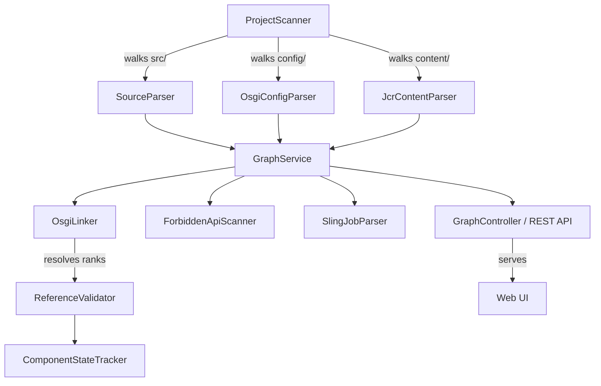

# Dede - AEM Cloud Service Readiness Analyzer

A static analysis tool for validating AEM codebase compatibility with AEM as a Cloud Service and visualizing component dependencies.

[](https://openjdk.org/projects/jdk/21/)
[](https://spring.io/projects/spring-boot)
[]()
[](https://github.com/features/packages)

---

## Why Dede?

### The Problem

Migrating AEM 6.x on-premise to AEM as a Cloud Service requires:
- Manual review of thousands of files for Cloud incompatibilities
- Tracking deprecated APIs, forbidden patterns, and hardcoded paths
- Understanding "if I change X, what breaks?"
- Adobe's rules scattered across docs, BPA output, and tribal knowledge

### What Dede Does

**One command. Full picture.**

```bash
java -jar dede.jar /path/to/your-aem-project
```

| Without Dede | With Dede |
|--------------|-----------|
| Run BPA, get XML blob, manually parse | JSON report, sorted by severity |
| Grep for deprecated APIs one by one | 25 rule categories checked automatically |
| "I think this servlet is safe to delete" | Dependency graph shows what uses it |
| Weeks of manual code review | Minutes |

### When to Use Dede

- **No running AEM instance** - BPA requires deployment; Dede runs on source code
- **CI/CD gate** - Catch Cloud violations before merge
- **Quick audit** - Unfamiliar codebases, acquisition due diligence
- **Impact analysis** - Before refactoring legacy code
- **Programmatic access** - JSON output for tooling integration

### Honest Limitations

- **Overlaps with BPA** - Adobe's Best Practices Analyzer is official and maintained
- **Static analysis only** - No runtime behavior, no content analysis
- **Dependency graph based on annotations** - Not full runtime call tracing

---

## Quick Start

### Prerequisites
- Java 21+
- Maven 3.9+

### Build & Run

```bash
# Build
mvn clean package -DskipTests

# Scan a project
java -jar target/dede-java-0.0.1-SNAPSHOT-exec.jar /path/to/aem-project

# With dependency graph export
java -jar target/dede-java-0.0.1-SNAPSHOT-exec.jar /path/to/aem-project --dot output.dot
```

### Command Line Options

```
Usage: dede <project-path> [options]

Options:
  --profiles <p1,p2>  Analysis profiles (default: aem)
  --dot <path.dot>    Export dependency graph to DOT format
  --json <path.json>  Export results to JSON
  --security          Enable security surface audit
```

---

## What It Detects

### Cloud Readiness Violations (25 Categories)

| Category | Severity | Description |
|----------|----------|-------------|
| `REPLICATION_API` | CRITICAL | Direct replication agent access |
| `JCR_OBSERVATION` | CRITICAL | JCR observation listeners (not Cloud-compatible) |
| `CUSTOM_RUNMODES` | CRITICAL | Non-standard runmodes |
| `WORKFLOW_PROCESS` | HIGH | Legacy workflow process steps |
| `HARDCODED_PATHS` | MEDIUM | Paths like `/etc/`, `/apps/` in code |
| `DEPRECATED_API` | MEDIUM | Deprecated AEM/Sling APIs |
| ... | ... | 25 categories total |

### Dependency Analysis

Detects relationships between:
- **Sling Servlets** → Resource types, paths, selectors, extensions
- **Sling Filters** → Filter scopes
- **Sling Models** → OSGi services, child resources, value injections
- **OSGi Components** → Service providers and consumers (with LDAP filter + service.ranking resolution)
- **Sling Jobs** → JobConsumer `@JobConsumer(slingJobTopics)` and `JobManager.addJob()` topology
- **Packages** → Classes → Methods

### OSGi Service Resolution

Dede validates OSGi `@Reference` cardinalities statically:

| Situation | Reported As |
|-----------|-------------|
| 1..1 reference with no provider | `UNSATISFIED_MANDATORY` |
| 1..1 with multiple providers, same service.ranking | `AMBIGUOUS_REFERENCE` |
| 1..1 with clear highest-ranked provider | Resolved silently |
| `@Reference(target="(vendor=Acme)")` LDAP filter | Filter evaluated against provider properties |

---

## Output Formats

### Console Summary
```
=== Dede Analysis Complete ===
Scanned: 579 Java files
Graph: 5,875 nodes, 14 edges
Violations: 0 CRITICAL, 0 HIGH, 12 MEDIUM, 47 INFO
```

### DOT Graph (Graphviz)
```bash
# Generate visual graph
java -jar dede.jar /project --dot architecture.dot

# Render to PNG
dot -Tpng architecture.dot -o architecture.png
```

### JSON Report
```json
{
  "violations": [
    {
      "category": "HARDCODED_PATHS",
      "severity": "MEDIUM",
      "file": "src/main/java/com/example/MyServlet.java",
      "line": 42,
      "message": "Hardcoded path '/etc/designs' should use config"
    }
  ],
  "graph": {
    "nodes": 5875,
    "edges": 14
  }
}
```

---

## Rule Configuration

Rules are defined in `src/main/resources/forbidden-apis.json`:

```json
{
  "version": "2.0",
  "categories": {
    "REPLICATION_API": {
      "description": "Direct replication agent access",
      "severity": "CRITICAL",
      "patterns": ["com.day.cq.replication.Agent"],
      "cloudManagerRule": "CST-1"
    }
  }
}
```

### Adding Custom Rules

1. Edit `forbidden-apis.json`
2. Add patterns to existing category or create new one
3. Rebuild

---

## REST API

Run as web server for programmatic access:

```bash
mvn spring-boot:run
```

| Endpoint | Description |
|----------|-------------|
| `GET /api/graph` | Full dependency graph |
| `GET /api/graph/stats` | Node and edge counts |
| `GET /api/graph/nodes/{id}` | Single node details |
| `GET /api/graph/nodes/{id}/incoming` | What depends on this node |
| `GET /api/graph/nodes/{id}/outgoing` | What this node depends on |
| `GET /api/graph/cycles` | Circular dependency detection |

Swagger UI: `http://localhost:8080/swagger-ui.html`  
GraphQL Explorer: `http://localhost:8080/graphiql`

#### Example Requests

```bash
# Get full graph
curl http://localhost:8080/api/graph

# Get stats
curl http://localhost:8080/api/graph/stats

# Find a node
curl http://localhost:8080/api/graph/nodes/bundle:core

# Detect circular dependencies
curl http://localhost:8080/api/graph/cycles

# Incoming dependencies for a node (blast radius)
curl http://localhost:8080/api/graph/nodes/bundle:core/incoming
```

---

## Profile System

Profiles define which annotations to track for dependency analysis.

### Built-in: `aem.json`

```json
{
  "mappings": [
    {
      "annotationName": "SlingServletResourceTypes",
      "attributeName": "resourceTypes",
      "nodeType": "JCR_RESOURCE_TYPE",
      "relationship": "HANDLES_RESOURCE_TYPE",
      "classType": "SLING_SERVLET"
    }
  ]
}
```

### Custom Profiles

Create `profiles/myprofile.json` and use:
```bash
java -jar dede.jar /project --profiles aem,myprofile
```

---

## Docker

```bash
# Pull from GitHub Container Registry
docker pull ghcr.io/your-org/dede-java:latest

# Run against a project
docker run --rm \
  -v /path/to/aem-project:/scan:ro \
  -p 8080:8080 \
  ghcr.io/your-org/dede-java:latest /scan

# Run as API server
docker run -p 8080:8080 ghcr.io/your-org/dede-java:latest
```

### Docker Compose

```yaml
services:
  dede:
    image: ghcr.io/your-org/dede-java:latest
    ports:
      - "8080:8080"
    volumes:
      - ./aem-project:/scan:ro
    command: /scan
```

---

## CI/CD Integration

### GitHub Actions

See [`examples/github-workflow.yml`](examples/github-workflow.yml) for a copy-paste workflow.

```yaml
- name: AEM Cloud Readiness Check
  run: |
    java -jar dede.jar ./core --json report.json
    if grep -q '"severity": "CRITICAL"' report.json; then
      echo "Critical Cloud violations found"
      exit 1
    fi
```

### Maven Plugin (Coming Soon)

```xml
<plugin>
  <groupId>com.dede</groupId>
  <artifactId>dede-maven-plugin</artifactId>
  <executions>
    <execution>
      <goals><goal>check</goal></goals>
      <configuration>
        <failOnCritical>true</failOnCritical>
      </configuration>
    </execution>
  </executions>
</plugin>
```

---

## AEM OSGi Bundle

Dede can also be deployed as an OSGi bundle directly in AEM for live JCR analysis.

### Installation

```bash
# Build the AEM bundle
cd dede-aem-bundle
mvn clean install

# Deploy to local AEM
mvn clean install -PautoInstallBundle
```

### AEM Bundle Features

| Feature | Standalone | AEM Bundle |
|---------|------------|------------|
| Source code analysis | ✅ | ❌ |
| Live JCR scanning | ❌ | ✅ |
| Dispatcher analysis | ✅ | ❌ |
| GraphQL API | ✅ | ❌ |
| Web UI | ✅ | ❌ |
| Real-time scanning | ❌ | ✅ |

### AEM REST API

```bash
# Scan /apps/wknd
curl -X POST -u admin:admin \
  "http://localhost:4502/bin/dede/graph/scan?path=/apps/wknd"

# Get cycles
curl -u admin:admin "http://localhost:4502/bin/dede/graph/cycles"

# Get suggestions
curl -u admin:admin "http://localhost:4502/bin/dede/graph/suggestions"
```

See [dede-aem-bundle/README.md](dede-aem-bundle/README.md) for full documentation.

---

## Architecture



---

## Development

```bash
# Run tests (188 tests)
mvn test

# Run with coverage
mvn test jacoco:report

# Build executable JAR
mvn clean package -DskipTests

# Build AEM bundle
cd dede-aem-bundle && mvn clean package
```

---

## Credits

Inspired by [dede](https://github.com/mitkox/dede) by Mitko Kolev.

---

## License

Apache 2.0
